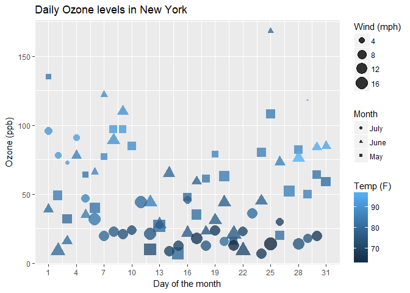
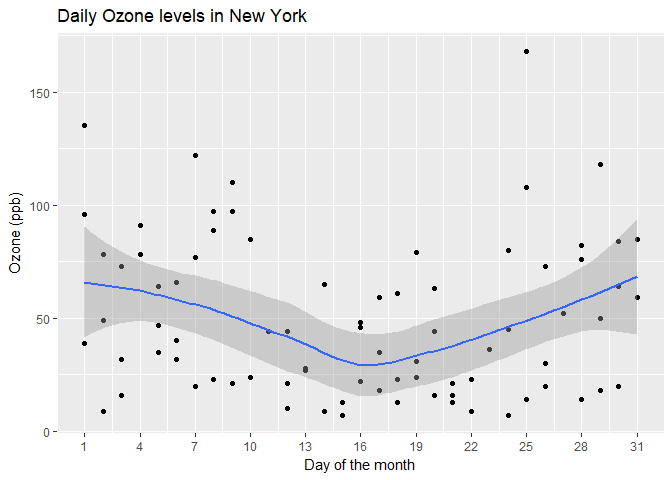
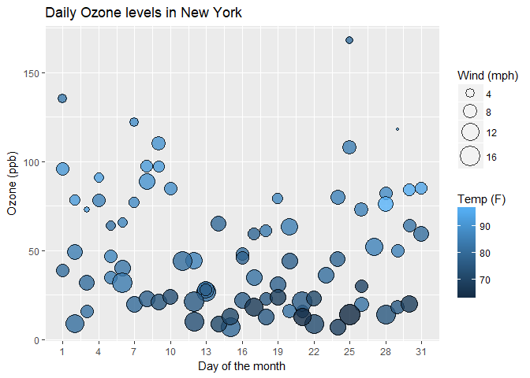
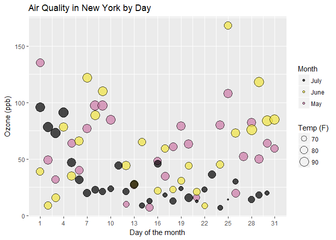
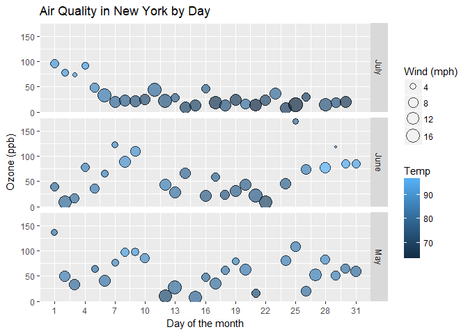

Visualising Air Quality in New York city
================

#### Introduction

The presense of Ozone gas at ground level can can affect human health. We would be visualising ozone levels using "Air Quality" dataset which has daily air quality measurements in New York from May to September 1973.

Initially, we import the data and convert month variable to factor as it represents a categorical value.

``` r
air_quality <- read.csv("airquality_3months.csv")
air_quality$Month <- factor(air_quality$Month)

library(ggplot2)
```

#### 1. Effect of Wind and Temperature on daily ozone levels:

Since, Month is a categorical variable, different shapes are chosen to represent different values. As temperature varies continuouly, it is depicted with gradients of colour, darkening as temperature increases. Also, wind being continuous variable, is shown with increase in size with wind speed. Scale on X-axis has been chosen to compare levels within 3 days interval
**Observations: ** We can see ozone levels dropping slighlty during mid-month. Ozone levels appear to be high when the temperature drops. Also, they seem to reduce with higher wind speeds.

``` r
ggplot(air_quality, aes(x=Day, y=Ozone, size=Wind, color=Temp, shape=Month)) + 
  geom_point(alpha = 0.8) + 
  ggtitle("Daily Ozone levels in New York") +
  labs(x = "Day of the month", y = "Ozone (ppb)", size = "Wind (mph)", color = "Temp (F)") +
  scale_x_continuous(breaks = seq(1, 31, 3)) +
  scale_size(range = c(1, 7))
```



However, the above plot appears very cluttered and tries to convey too much information which could be confusing. Hence we can visualise the following paramters separately.

#### **2. Observing monthly trends in ozone levels:**

A scatterplot of only Ozone levels against days of the month, aided by a smoothening line, reveals the trend of ozone levels dropping mid-month

``` r
ggplot(air_quality, aes(x = Day, y = Ozone)) + geom_point() + geom_smooth() +
  ggtitle("Daily Ozone levels in New York") +
  labs(x = "Day of the month", y = "Ozone (ppb)") +
  scale_x_continuous(breaks = seq(1, 31, 3))
```



#### **3. Wind and Temperature come into the picture:**

We can isolate the effect of wind and temperature on ozone levels by excluding the monthly seggregation. Since, both are continuous variables, use of size and fill gradient is effective in visualing the data. Also, use of alpha makes it easy to see overlapping patterns at low ozone levels

``` r
ggplot(air_quality, aes(x = Day, y = Ozone, size = Wind, fill = Temp)) +
  geom_point(shape = 21, alpha = 0.8) +
  ggtitle("Daily Ozone levels in New York") +
  labs(x = "Day of the month", y = "Ozone (ppb)", size = "Wind (mph)", fill = "Temp (F)") +
  scale_x_continuous(breaks = seq(1, 31, 3)) +
  scale_size(range = c(1, 9))
```



#### **4. Month-wise effect of temperature on daily ozone levels:**

Next, we visualize effect of Temperature on daily ozone levels in 3 months. Colour is better differentiator than shape and so I used colours for categorising monthly data. Size is used for continuous variable like temperature.

**<span style="color:blue">Consideration for colours:</span>** Combination of green and red, blue and gray, blue and purple and so on, which can be ineffective for ***colour-blind*** audience has been avoided. Darker hue has been used to highlight particularly lower ozone levels during the month of July. Also, these colours appear effective if the report is printed in grayscale.

``` r
#Designing color palatte to be effective for all users including color-blind
cbPalette <- c("#000000", "#F0E442","#CC79A7")

ggplot(air_quality, aes(x = Day, y = Ozone, fill = Month, size=Temp)) +
  geom_point(shape = 21, alpha = 0.7) +
  ggtitle("Air Quality in New York by Day") +
  labs(x = "Day of the month", y = "Ozone (ppb)", size = "Temp (F)") +
  scale_x_continuous(breaks = seq(1, 31, 3)) +
  scale_size(range = c(1, 7)) +
  scale_fill_manual(values=cbPalette)
```



#### **5. Month-wise effect of wind speed and temperature on daily ozone levels:**

The combined effect of wind speed & temperature on daily ozone levels accross 3 months can be visualised as below:

As earlier, darker hue highlights particularly lower ozone levels during the month of July

``` r
ggplot(air_quality, aes(x = Day, y = Ozone, size=Wind, fill=Temp)) +
  geom_point(shape = 21, alpha = 0.7) +
  facet_grid(Month~.) +
  ggtitle("Air Quality in New York by Day") +
  labs(x = "Day of the month", y = "Ozone (ppb)", size = "Wind (mph)") +
  scale_x_continuous(breaks = seq(1, 31, 3)) +
  scale_size(range = c(1, 7))
```



#### **Conclusion**

The visuals reveal a clear pattern that lower temperatures during month of July along with relatively greater wind speeds seem to keep ground ozone levels low. The air quality seems to be significantly better in July, whereas in May, ozone levels are likely to be on the higher side.
