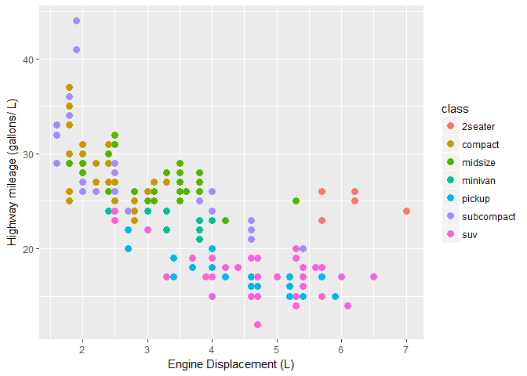

Fuel Economy of Cars
================

The fuel efficiency of cars is a matter of concern for many car owners. Everybody loves to get the maximum returns till the last drop of fuel is exhausted! However, we also expect the car to be powerful enough to get us through daily city commute as well as those weekend drives over the highways. The fuel efficiency of the car depends upon variety of factors. Some of the factors that form motivation for this report are: 1. How do different types of cars fare on highways, taking into consideration their engine displacement? 2. How does number of cylinders in engine affect the highway performance in relation to engine displacement? 3. How does city mileages of various cars compare with each other? 4. Which cars return an above or below average mileages? 5. What is degree of correlation between various factors that decide fuel economy?

**Data source:** The dataset used is Fuel economy data from 1999 and 2008 for 38 popular models of cars that the EPA makes available on <http://fueleconomy.gov>. Fuel economy data are the result of vehicle testing done at the Environmental Protection Agency's National Vehicle and Fuel Emissions Laboratory in Ann Arbor, Michigan, and by vehicle manufacturers with oversight by EPA.

### Load the required packages

``` r
library(ggplot2)
library(ggcorrplot)
#Import mpg dataset from ggplot package
cars <- ggplot2::mpg
```

### 1. How do different types of cars fare on highways, taking into consideration their engine displacement?


